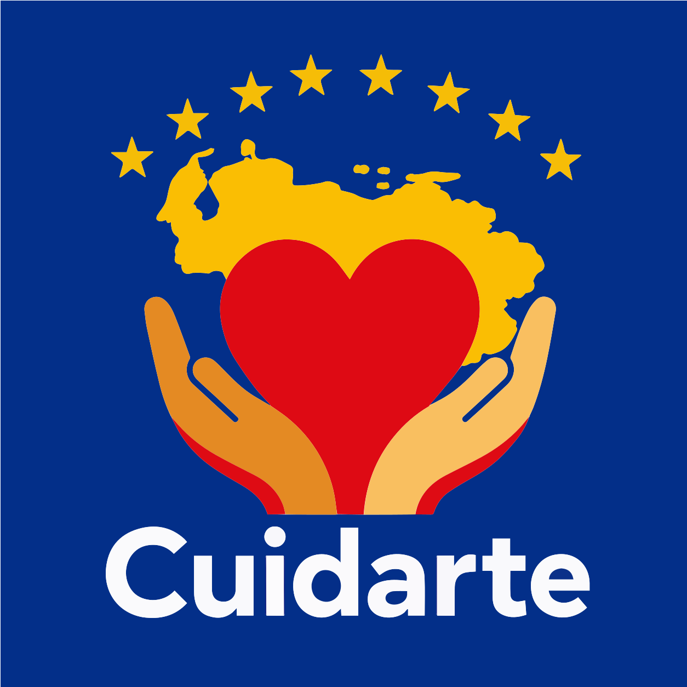

<div align="center">
  
  
  # Cuídarte Venezuela — Panel de Voluntarios 🛡️
  
  **App de administración para carga masiva de pacientes y gestión de transporte**

  [](#)
  [](#)
  [](LICENSE)
  [](#)
</div>

---

## 🎯 Propósito

Aplicación web para que los **voluntarios en campo** registren pacientes, medicamentos y transporte de forma rápida y eficiente durante la emergencia sísmica en Venezuela (junio 2026). Diseñada para funcionar en dispositivos móviles con conexiones limitadas.

Este panel alimenta los datos que se muestran en la [app pública de búsqueda](https://cuidartevzla.freedev.app).

### ¿Qué pueden hacer los voluntarios?

- 📋 **Carga masiva de pacientes** desde Excel, CSV, texto pegado o **PDFs escaneados**
- 📸 **Escanear listados impresos** con la cámara del celular (OCR local + IA)
- 🤖 **Pipeline OCR híbrido** — Tesseract.js en el navegador, con fallback automático a Gemini Flash cuando la imagen es borrosa
- ✅ **Tabla de revisión** para verificar, editar y confirmar cada paciente antes de guardar
- 🚛 **Gestión de transporte voluntario** — registrar vehículos, actualizar disponibilidad
- 🔒 **Sistema de código voluntario** para autenticación y auditoría

---

## 🏗️ Arquitectura

```
┌──────────────────────────────────────────────────────┐
│              Panel de Voluntarios (SPA)               │
│                                                      │
│  ┌──────────────┐  ┌──────────────┐  ┌────────────┐ │
│  │ Carga Masiva │  │ Escaneo OCR  │  │ Transporte  │ │
│  │              │  │              │  │             │ │
│  │ • Excel/CSV  │  │ • Cámara     │  │ • Registrar │ │
│  │ • Texto      │  │ • Imagen     │  │ • Editar    │ │
│  │ • PDF (pdfjs)│  │ • PDF        │  │ • Eliminar  │ │
│  └──────┬───────┘  └──────┬───────┘  └──────┬──────┘ │
│         │                 │                 │         │
│         │    ┌────────────▼────────────┐    │         │
│         │    │   Pipeline OCR Híbrido  │    │         │
│         │    │                         │    │         │
│         │    │  1. OpenCV.js (binarize)│    │         │
│         │    │  2. Tesseract.js (OCR)  │    │         │
│         │    │  3. ¿Confianza<70%?     │    │         │
│         │    │     └─ Gemini Flash ────│    │         │
│         │    └────────────┬────────────┘    │         │
│         │                 │                 │         │
│         └─────────┬───────┴────────┬────────┘         │
│                   ▼                ▼                   │
│              ┌──────────────────────────┐              │
│              │    Tabla de Revisión     │              │
│              │   (valida, edita, conf.) │              │
│              └───────────┬──────────────┘              │
└──────────────────────────┼─────────────────────────────┘
                           │ fetch() + X-Codigo-Voluntario
                           ▼
              ┌────────────────────────────┐
              │   Backend cuidartevzla     │
              │   /api/pacientes_lote.php  │
              └────────────────────────────┘
```

---

## 📦 Stack Técnico

| Capa | Tecnología |
|------|-----------|
| Framework | React 19, Vite 6, TypeScript |
| Estilos | Tailwind CSS 4, Lucide Icons |
| Animaciones | Motion (Framer Motion) |
| OCR Local | Tesseract.js v7 (WASM, español) |
| Preprocesamiento | OpenCV.js (umbral adaptativo, binarización) |
| PDF | pdf.js (renderizado de páginas a canvas) |
| OCR con IA | Gemini 2.0 Flash vía OpenRouter (fallback automático) |
| Datos | SheetJS (xlsx), fetch() a API REST PHP |
| PWA | Service Worker offline-ready, Web Manifest |
| IA (opcional) | Google GenAI SDK |
| Deploy | `/voluntarios/` — hosting compartido con la app pública |

---

## 🔄 Pipeline OCR Híbrido

El corazón del sistema de escaneo de listados:

| Paso | Herramienta | Local/Cloud |
|------|------------|-------------|
| 1. Preprocesar | OpenCV.js (WASM) | ✅ 100% local |
| 2. OCR | Tesseract.js v7 | ✅ 100% local |
| 3. Evaluar confianza | `avgBatchConfidence()` | ✅ local |
| 4. Si confianza < 70% | Gemini 2.0 Flash (OpenRouter) | ☁️ ~$0.00015/pág |

**Ventaja:** La gran mayoría de escaneos se procesan sin costo. Solo las imágenes realmente borrosas disparan la IA.

---

## 🚀 Quick Start

```bash
# 1. Clonar
git clone https://github.com/javierdiazbolanos/cuidartevzla-admin.git
cd cuidartevzla-admin

# 2. Instalar dependencias
npm install

# 3. Configurar API Key (opcional — sin ella, el OCR es 100% local)
cp .env.example .env
# Editar .env y agregar tu VITE_OPENROUTER_API_KEY de https://openrouter.ai/keys

# 4. Desarrollo
npm run dev          # → http://localhost:3000/voluntarios/

# 5. Build producción
npm run build        # → dist/
npm run preview      # Preview local del build
```

### Requisitos

- **Node.js 18+** (recomendado 20+)
- **Navegador moderno** con soporte WebAssembly (Chrome, Firefox, Safari, Edge)
- **API Key de OpenRouter** (opcional — solo para fallback IA en OCR)
- **Backend PHP/MySQL** corriendo en el mismo dominio (la app hace fetch a `/api/*`)

---

## 📂 Estructura del Proyecto

```
src/
├── App.tsx                    # App principal con tabs y estado global
├── main.tsx                   # Entry point
├── types.ts                   # Interfaces TypeScript (Paciente, Hospital, etc.)
├── index.css                  # Estilos globales (Tailwind)
├── components/
│   ├── MassiveLoader.tsx      # Carga masiva: paste, CSV, Excel, PDF, OCR
│   ├── ReviewTable.tsx        # Tabla de revisión pre-subida
│   ├── IndividualPatient.tsx  # Registro individual de paciente
│   ├── TransportManager.tsx   # CRUD de transporte voluntario
│   ├── SecurityGate.tsx       # Pantalla de login (código voluntario)
│   └── TickerBar.tsx          # Barra de alertas y estado
└── utils/
    ├── ocr.ts                 # Tesseract.js + OpenCV.js + parseo de palabras
    ├── llm-ocr.ts             # Fallback LLM vía OpenRouter (Gemini Flash)
    └── api.ts                 # Cliente HTTP con fallback a localStorage
```

---

## 📡 Endpoints que Consume

El panel se comunica con los mismos endpoints de la [app pública cuidartevzla](https://github.com/javierdiazbolanos/cuidartevzla):

| Endpoint | Método | Uso en el panel |
|----------|--------|----------------|
| `/api/hospitales.php` | GET | Lista de hospitales para los dropdowns |
| `/api/pacientes.php?q=` | GET | Búsqueda de duplicados antes de guardar |
| `/api/pacientes_lote.php` | POST | Guardar lote de pacientes revisados |
| `/api/transporte.php` | GET/POST/PUT/DELETE | CRUD de transporte voluntario |
| `/api/pacientes.php` | POST/PUT | Registro y edición individual de pacientes |

**Autenticación:** Header `X-Codigo-Voluntario` con código numérico del voluntario.

---

## 🤝 Convenciones de Commit

Usamos [Conventional Commits](https://www.conventionalcommits.org/):
- `feat:` nueva funcionalidad
- `fix:` corrección de bug
- `docs:` cambios en documentación
- `refactor:` mejora de código sin cambiar funcionalidad
- `chore:` tareas de build, dependencias, configuración

---

## 👥 Para el Equipo de Voluntarios

### Flujo de trabajo típico

1. **Abrir la app** en `/voluntarios/` en el celular
2. **Ingresar código de voluntario** (4 dígitos)
3. **Elegir método de carga:**

   **Opción A — Pegar Lista (para datos digitales)**
   - Pegar desde WhatsApp, Google Sheets o Excel
   - O arrastrar archivo `.xlsx`, `.csv`, o `.pdf`

   **Opción B — Escanear Foto (para listados impresos)**
   - Tomar foto del listado con la cámara
   - O subir imagen/PDF desde el teléfono
   - El OCR extrae los datos automáticamente

4. **Revisar en la tabla**: verificar nombres, cédulas, edades y sexo
5. **Confirmar envío**: los datos se guardan y aparecen en la app pública

---

<div align="center">
  <sub>Desarrollado en solidaridad con el pueblo venezolano ❤️🇻🇪</sub>
</div>